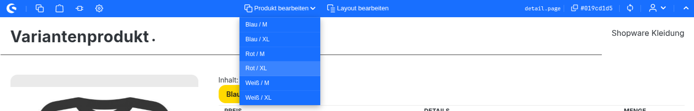
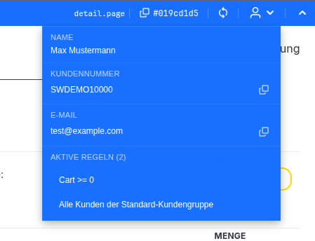

# WakoPluginAdminToolbar

Shopware 6 storefront plugin that shows a fixed administration toolbar at the top of the storefront for eligible administration users, including quick links into the Shopware Administration, context-aware edit buttons for products, categories, variants, CMS pages and shopping experiences, customer context insights, rule visibility, copy-to-clipboard helpers, and cache clearing.

## Screenshots

### Screenshot 1


### Screenshot 2 — Context button for products, variants, and shopping experiences



### Screenshot 3 — Customer context



## What it does

The toolbar can provide:
- quick links into Shopware Administration
- context-aware edit links for product/category/CMS/landing page related storefront pages
- variant lookup for variant products
- customer context info for the current sales channel session
- active rule visibility
- copy-to-clipboard helpers
- cache clear action
- global feature switches for product links, category links, and CMS/layout links
- per-user feature preferences for product links, category links, CMS/layout links, and customer context

## Security & Permission Model

This plugin must adhere to the Shopware Administration **roles, permissions, and privileges** system.

### Mandatory principles

- All privileged actions are enforced **server-side**
- UI visibility is only convenience, not authorization
- The user custom field `wako_admin_toolbar_enabled` is only an opt-in toggle
- Per-user feature preferences and global plugin switches are additional gates, not authorization by themselves
- Toolbar access also requires Shopware ACL privileges
- New privileged features must integrate with ACL end-to-end

### Base access requirement

The toolbar is only available when all of the following are true:
- a valid Shopware admin session exists
- the user enabled the toolbar via `wako_admin_toolbar_enabled`
- the user has the plugin privilege `wako_admin_toolbar:use`

The plugin registers the role permission:
- `wako_admin_toolbar.viewer` → `wako_admin_toolbar:use`

## Feature to privilege mapping

| Feature | Required privilege(s) | Additional gates |
|---|---|---|
| Use toolbar at all | `wako_admin_toolbar:use` | Per-user toolbar opt-in |
| Clear cache | `system:clear:cache` | — |
| Load variants | `product:read` | Product links enabled globally and for the user |
| Edit product | `product:update` | Product links enabled globally and for the user |
| Edit category | `category:update` | Category links enabled globally and for the user |
| Edit CMS page / layout / shopping experience / page | `cms_page:update` | CMS/layout links enabled globally and for the user |
| Edit landing page | `cms_page:update` + `landing_page:update` | CMS/layout links enabled globally and for the user |
| View customer context | `customer:read` | Customer context enabled for the user and at least one customer context data field enabled globally |
| View active rules / rule links | `rule:read` | Customer context enabled for the user and active rules enabled globally |

## Development rule for future changes

Whenever you add a new action, endpoint, or toolbar button:

1. define the needed Shopware/core or plugin privilege
2. enforce it in backend PHP code
3. expose only minimal capability flags if the storefront/admin UI needs them
4. hide or disable the related UI accordingly
5. register admin privilege labels/snippets for plugin-specific permissions

## Current user administration module

The plugin provides a dedicated administration settings module for the currently logged-in user.

Location:
- **Administration → Settings → Plugins → Admin Toolbar**

Current scope:
- enable or disable the storefront admin toolbar for the own account
- configure personal visibility preferences for product links, category links, CMS/layout links, and customer context
- show disabled feature toggles when the user lacks the required ACL permission or a feature is disabled globally

The module itself is available with:
- `user.update_profile`

Changing toolbar activation and feature preferences requires:
- `user_change_me`
- `wako_admin_toolbar:use`
- the corresponding feature ACL permission when enabling a feature

Notes:
- the toolbar activation setting is no longer edited in the Shopware profile page
- personal feature preferences are stored on the current user and are enforced server-side when toolbar capabilities are built

## Plugin configuration

The plugin configuration contains:
- `adminBasePath` for the Administration base path
- global toolbar feature switches for product links, category links, and CMS/layout links
- customer context data controls for email, customer number, and active rules

The customer context dropdown only renders sections whose data fields are enabled in the plugin configuration.

## Relevant files

- `src/WakoPluginAdminToolbar.php`
- `src/Controller/AdminToolbarAuthController.php`
- `src/Controller/AdminToolbarProfileController.php`
- `src/Resources/views/storefront/component/admin-toolbar.html.twig`
- `src/Resources/app/storefront/src/js/admin-toolbar/admin-toolbar.plugin.js`
- `src/Resources/app/administration/src/acl/index.js`
- `src/Resources/app/administration/src/module/wako-admin-toolbar-settings/`
- `src/Resources/app/administration/src/snippet/en-GB.json`
- `src/Resources/app/administration/src/snippet/de-DE.json`

## Build

From the Shopware root:

```bash
bin/console plugin:refresh
bin/console plugin:install --activate WakoPluginAdminToolbar
bin/console cache:clear
./bin/build-storefront.sh
./bin/build-administration.sh
```
