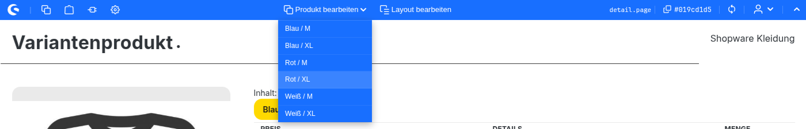
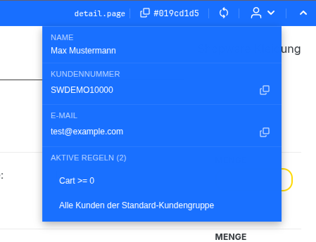

# WakoPluginAdminToolbar

A Shopware 6 plugin that adds an administration toolbar to the storefront. Eligible administration users can open the current product, category, CMS page, or shopping experience in the Administration without first searching for it.

## Requirements

- Shopware 6.7
- Shopware Storefront and Administration

Version 2.0.0 and newer no longer support Shopware 6.6.

## Installation

Run this command from the Shopware root:

```bash
composer req wako/plugin-admin-toolbar
```

Alternatively, extract the release archive into `custom/plugins`. Then install and activate the plugin:

```bash
bin/console plugin:install --activate WakoPluginAdminToolbar
```

## Screenshots

### Screenshot 1


### Context buttons for products, variants, and shopping experiences



### Customer context



## What it does

The toolbar provides:

- quick links into Shopware Administration
- context-aware edit links for product/category/CMS/landing page related storefront pages
- variant lookup for variant products
- customer context info for the current sales channel session
- active rule visibility
- copy-to-clipboard helpers
- cache clear action
- global feature switches for product links, category links, and CMS/layout links
- per-user feature preferences for product links, category links, CMS/layout links, and customer context

## Security and permissions

The plugin uses Shopware Administration roles and privileges. Hiding a control in the storefront does not authorize the underlying action.

### Required rules

- The server enforces every privileged action
- UI visibility is a convenience, not authorization
- The user custom field `wako_admin_toolbar_enabled` only opts the user in
- Per-user preferences and global plugin switches restrict features but do not authorize them
- Toolbar access also requires Shopware ACL privileges
- New privileged features must integrate with ACL end-to-end

### Base access requirement

The toolbar is available only when all of these conditions are met:

- a valid Shopware admin session exists
- the user enabled the toolbar via `wako_admin_toolbar_enabled`
- the user has the plugin privilege `wako_admin_toolbar:use`

The plugin registers the role permission `wako_admin_toolbar.viewer`, which grants `wako_admin_toolbar:use`.

The public storefront HTML contains only an empty toolbar bootstrap element. The auth endpoint returns and JavaScript mounts the full Twig-rendered toolbar only after these checks succeed. Disabled users and anonymous crawlers therefore receive no toolbar text, SVG sprite, or Administration links in the page source.

## Feature-to-privilege mapping

| Feature | Required privilege(s) | Additional gates |
|---|---|---|
| Use toolbar at all | `wako_admin_toolbar:use` | Per-user toolbar opt-in |
| Clear cache | `system:clear:cache` | None |
| Load variants | `product:read` | Product links enabled globally and for the user |
| Edit product | `product:update` | Product links enabled globally and for the user |
| Edit category | `category:update` | Category links enabled globally and for the user |
| Edit CMS page / layout / shopping experience / page | `cms_page:update` | CMS/layout links enabled globally and for the user |
| Edit landing page | `cms_page:update` + `landing_page:update` | CMS/layout links enabled globally and for the user |
| View customer context | `customer:read` | Customer context enabled for the user and at least one customer context data field enabled globally |
| View active rules / rule links | `rule:read` | Customer context enabled for the user and active rules enabled globally |

## Adding privileged features

For every new action, endpoint, or toolbar button:

1. Define the required Shopware core or plugin privilege.
2. Enforce it in the PHP backend.
3. Expose only the capability flags required by the storefront or Administration UI.
4. Hide or disable the corresponding UI.
5. Register Administration labels and snippets for plugin-specific privileges.

## User settings

The current user can configure the toolbar under **Administration > Settings > Plugins > Admin Toolbar**.

The module allows users to:

- enable or disable the storefront toolbar for their account
- configure personal visibility preferences for product links, category links, CMS/layout links, and customer context
- show disabled feature toggles when the user lacks the required ACL permission or a feature is disabled globally

Opening the module requires `user.update_profile`.

Changing toolbar activation or feature preferences requires:

- `user_change_me`
- `wako_admin_toolbar:use`
- the corresponding feature ACL permission when enabling a feature

Toolbar activation is no longer part of the Shopware profile page. The plugin stores preferences on the current user and enforces them on the server when it builds the available toolbar capabilities.

## Plugin configuration

The plugin configuration contains:

- `adminBasePath` for the Administration base path
- global toolbar feature switches for product links, category links, and CMS/layout links
- customer context data controls for email, customer number, and active rules

The customer context dropdown only renders sections whose data fields are enabled in the plugin configuration.

## Relevant files

- `src/WakoPluginAdminToolbar.php`
- `src/Controller/AdminToolbarAuthController.php`
- `src/Controller/AdminToolbarProfileController.php`
- `src/Resources/views/storefront/component/admin-toolbar-bootstrap.html.twig`
- `src/Resources/views/storefront/component/admin-toolbar.html.twig`
- `src/Resources/app/storefront/src/js/admin-toolbar/admin-toolbar.plugin.js`
- `src/Resources/app/administration/src/acl/index.js`
- `src/Resources/app/administration/src/module/wako-admin-toolbar-settings/`
- `src/Resources/app/administration/src/snippet/en-GB.json`
- `src/Resources/app/administration/src/snippet/de-DE.json`
